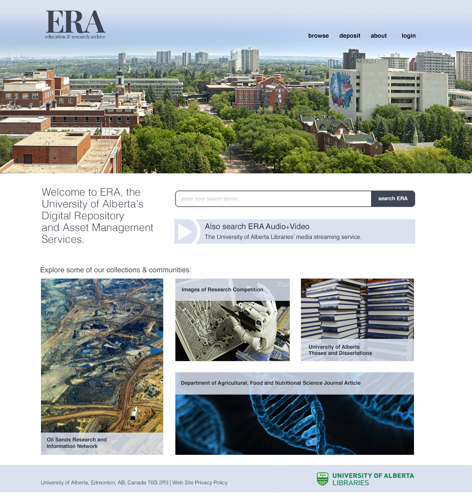

## The Jupiter Project 
Jupiter is a [HydraNorth](https://github.com/ualbertalib/HydraNorth) initiative to create a sustainable and extensible digital asset management system. The application is built with standard Rails, HydraWorks and Fedora/OpenStack Swift. **Jupiter**, the initial IR-based application is a component of the wider DAMS implementation strategy. Our commitment is to digitally preserve items in this component of the DAMS system and ensure that they are discoverable and usable for the long term. Also critical to our work is user experience evidence, which we gather through an embedded project process involving research on standard usability conventions for various CRUD application functions, wireframes, rapidly-gathered UX feedback, and in-depth UX testing (including accessibility testing) for the use of the entire implementation team. 

